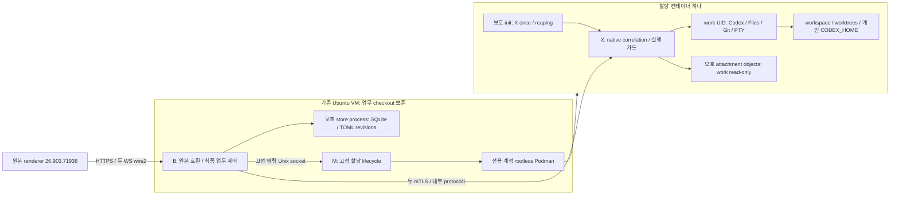

# S9 — 통합 책임과 검증 가능한 설계 완료 기준

이 문서는 003 최종 설계의 책임 연결·대표 흐름·품질 시나리오를 소유한다. 구현 작업 순서/코드 변경 목록의
plan이나 실행 PASS가 아니다. 대상은 한 사용자의 한 할당 컨테이너이며 002의 잔여 출시 작업을 합치지 않는다.

## 1. 목표 topology와 의존 방향

외부 할당 계층은 향후 고정 manifest를 공급하는 접점이다. 지금은 operator가 한 manifest를 제공한다.
M이 계정/스케줄링/멀티테넌트 플랫폼 역할을 맡거나 B가 runtime socket으로 임의 컨테이너를 고르지 않는다.
원본 호환 adapter→core/ports 방향으로 의존하고 DB/TLS/Podman 구현은 port 뒤에 둔다. core에서
SQLite SQL·TLS socket·Podman argv·Cap'n export ID를 직접 다루지 않는다. 조립부는 구현을 고르되 새로운 업무 권위를 갖지 않는다.

### 변경 책임

| 책임 | 소유 계약 | 기존 자산의 취급 |
|---|---|---|
| 원본 호환 | serializer·Cap'n Web·host bridge·browser 저장/다운로드·두 WS document group | 원본 prepared renderer와 patch anchor/hash 검사 유지. 새 사용자 UI로 대체하지 않음 |
| B core | principal/allocation, controller, attempt/approval 소비, unknown, queue/automation admission | EngineOwnership·native binding·canonical queue의 의미 재사용. transport·process·store 구현 가정은 제거 |
| B store port/process | transaction/정본 revision/락/불명 저장·현재 TOML object pointer | 기존 atomic/fence의 의미를 SQL transaction 및 파일 publication 경계로 옮김. 과거 JSON 파일을 몰래 이중 writer로 유지하지 않음 |
| X engine port | 고정 engine spawn, 원래 native id, writer/framer, engine events | EngineSession/stdin-writer/owned-process의 수락·실제 종료 의미 재사용. 원격 close를 processExited로 바꾸지 않음 |
| work helper ports | file/git/worktree/PTY 실행과 namespace·UID·자원 소유 | fd/path 검증·opcode argv·natural exit 회귀를 컨테이너 실제 경계에서 다시 검증 |
| M runtime port | 고정 generation/prepare/grant/fence/stop/실제 scope 관찰 | 기존 소유 PID 기록만 복원하는 종료는 사용하지 않음. 제한된 Podman/systemd adapter 새 구현 |

원본 frontend 변경 하나는 호환 adapter/patch manifest와 원본 계약 시험에, runtime 변경 하나는
M/X의 실행 adapter와 namespace/종료 시험에 국소화되어야 한다. 이 표는 파일을 쪼개라는 지시가 아니라
다른 기능의 업무 판단까지 변경하지 않아도 되는 경계다. runtime 격리에 영향을 주는 실제 공통 계약은 함께 검토한다.

[호환 범위 대조](compatibility-coverage.md)는 기존 각 source family의 책임 이동과 original renderer의 저장소
조사 범위를 연결한다. projectless·폴더 선택·account projection·automation rollout처럼 VM 파일 가정이 숨은
경로도 포함한다. S7 D7.10의 artifact cache 선택은 실제 원본 loader 동작과 준비 patch 검증의 대상이다.

## 2. 대표 정상 흐름: 첨부한 메시지 한 건

1. 운영자가 고정 manifest로 준비한 M/container/X/B가 S6의 이전 scope 종료·현재 identity·grant를 확인한다.
   사용자가 전용 HTTPS origin에서 인증하면 B가 server-selected allocation/data namespace를 제공한다.
2. 두 WS가 같은 인증 session/document/build에 결합한다. 원본 editor는 모드별 정확한 serializer를 사용하고
   새 메시지·worktree 첫 입력·후속·queue 경로에서 추가 escape/trim 변환을 하지 않는다.
3. 첨부는 S7의 제한·staging·X 불변 bytes·B ready/reference commit 뒤 원본 경로 입력에 연결된다.
   browser가 보낸 파일명/path/registry나 engine가 출력한 path가 새로운 VM 파일 권한이 되지 않는다.
4. B는 현재 thread/controller/할당/정책과 original action을 검증한다. store transaction이 attempt 소비·hold·
   필요한 exact queue bind를 확정한다. RPC handoff 뒤 unknown이면 자동 재전송하지 않는다.
5. X는 current pair/dispatch sequence/예산을 검증하고 실제 native writer 직전에 다시 fence를 확인한다.
   원래 native 요청과 상관된 `result.turn.id`가 왔을 때 수락을 기록한다. X ACK와 별개다.
6. B는 사실을 먼저 정착하고 durable 결과는 commit 후 event ACK를 보낸다. 원본 UI가 streaming/승인을
   표시하며 필요할 때 현재 controller만 한 번 답한다. 답의 writer 성공과 engine resolved는 다른 사건이다.
7. Files/Review/PTY는 같은 container workspace를 관찰한다. UI generation·bytes/hash/Git diff와 실제 파일을
   대응시키고 작업을 재열면 같은 dataId의 history/settings를 복원한다.

새 thread 첫 생성과 첫 turn, worktree 생성과 첫 turn, 첨부 publication과 turn은 각각 다른 효과다.
중간 성공·후속 불명을 한 transaction처럼 취소하지 않는다. 첫 native thread의 수명이 같은 engine 연결에
의존하는 기존 계약을 보존하고 기존 creation binding의 exact mapping 뒤 첫 제출을 연결한다.

## 3. 장애 결과 표

| 자극 | 유지/무효화·사용자 결과 | 새 업무를 여는 근거 |
|---|---|---|
| browser 한 WS 단절 | 두 WS/RPC/구독을 닫고 같은 revision 초안 보존. 이미 보낸 요청·승인은 그대로 관찰 대상 | 같은 data 인증·새 document group·현재 controller/engine. live peer 선점/자동 재전송 없음 |
| B/X transport 한쪽 단절 | internal pair fence. 각 live owner의 소비/승인/결과/credit 보존 | same-live 증명·CAS pair 복구·event/correlation/credit 대조 |
| X ACK 뒤 browser 응답 유실 | 원래 attempt 상태 조회. ACK만 있으면 accepted라고 표시하지 않음 | 원래 correlated result 또는 명확한 미진입 근거. lookup miss는 unknown |
| B process 상실 | DB에 확정된 과거 사실/초안 보존. 새 B는 live engine 제어 불가 | old B/store 실제 종료·lock 해제, M의 명시적 cold recovery, old container scope 종료 |
| X 또는 M 연속성 상실 | 새 업무 fence. 남은 작업 자동 kill/재시작 없음 | operator의 정확한 할당 cold recovery 및 S6 stopped 증거 |
| DB commit reply 유실/worker 상실 | consumed/unknown을 자동 ready로 바꾸지 않음. writable worker 대체 전에 원래 transaction 관찰 | 동일 data/락/generation, 확정 저장 상태; core 불명이면 계속 fence |
| TOML/첨부 객체 missing/hash mismatch | 현재 pointer/참조를 성공으로 만들지 않음. 필요한 기능·claim 차단 | exact object 복구/명시적 새 revision. 과거 snapshot 자동 선택 없음 |
| build 변경 | stable data/초안은 유지. 같은 새 build의 문서와 두 WS 사용 | 새 정확한 build/protocol/manifest, old capability·연결 정리 |
| cleanup deadline 초과 | 미확인 scope/permit 표시. 새 generation 차단 | 실제 범위 종료/정리 후 단 한 번 반환. timeout을 정상 종료로 기록하지 않음 |

valid approval은 현재 engine가 유지하는 동안만 유효하다. browser 인증 만료·조회 읽음·inbox archive는
승인 응답이 아니다. engine 종료가 확인되면 옛 approval ID는 새 engine에 전달할 수 없다.

## 4. 기능별 003 수락 범위

원본 지원 계약을 컨테이너 경계에 연결한다. 전체 002 기능 출시·그 남은 결함을 모두 해결했다고 주장하지 않는다.

| 기능/AC | 고정 입력/관찰 | 기존 의미를 이어갈 부분 |
|---|---|---|
| 입력/AC1,3,11 | plain/rich, 밑줄·역슬래시·따옴표·백틱·달러·개행·한글, 동일 입력의 새 작업/후속/worktree/queue/초안 | 원본 serializer 결과와 실제 native bytes. 의미 있는 escape를 일괄 제거하지 않음 |
| 첨부/save/AC2,9,10 | 이미지·일반 파일, 원본hash·20MiB 경계·symlink·cancel·재시작 | read-only 보호 object·1GiB·24h 무참조 임시 정리. browser save outcome/void download와 cancel 구별 |
| Files/Review/worktree/AC2,3 | container 고유 표식·동일 파일 순차 변경2회·old snapshot·worktree reopen, VM 별도 sentinel | Git metadata cache/snapshot generation·partial/conflict·원래 반환 형태. VM workspace fallback 없음 |
| PTY/AC2,6,8,10 | 추가 실제 입력, resize/close/자연 종료·setsid child·transport 손실 | per-connection 종료 정책, 명령/입력 재실행0, 실제 scope/permit 정리 |
| 제어/승인/AC4,6,7,8 | 복제 탭 동시 claim·응답 유실·same-live recovery·stale generation | pending/offered response/current owner/CAS/한 번 소비. resolved와 writer ACK 구별 |
| automation/inbox/AC8,9 | browser 없는 cron/heartbeat, busy/승인/unknown run, TOML revision import, 읽음/보관 | activeRuns3, 원래 RRULE/timezone/DST/jitter 모듈, 주기 단일 claim·현재 정책 재검증·무알림이 실패/승인을 숨기지 않음 |
| 기동/identity/AC1,4,5,8,12 | 정확한 image/build/config·두 환경 sentinel·wrong allocation/auth·code-only 복귀 | data 유지, 관리권한 비노출, cold recovery 범위 명시 |

자동화는 B scheduler 하나와 store claim으로 실행하고 X를 foreground와 같은 port로 사용한다.
claim·실행/승인/unknown 동안 슬롯을 유지하며 heartbeat는 같은 thread 사용자 실행과 충돌하지 않는다.
기존 설정/ledger 자료의 실제 import 여부와 기능 지원 상태는 명시한다. 이행으로 미지원 API를 성공처럼 광고하지 않는다.

## 5. 세 품질의 관측과 판정

ISO/IEC 25010의 성능 효율성·유지보수성·신뢰성을 intent의 주요 품질로 적용한다. 인증/격리는 R4/R5의
고정 제약이다. 표준 인증이나 임의 종합 점수/가중치를 만들지 않는다.

| 품질/시나리오 | 관찰 | 판정 근거 |
|---|---|---|
| 성능: 같은 1만파일/변경200 fixture, 원래 warmup50+500표본×3round | host8동시/작은 file/실제 thread-list20/각 Git round p95, busy/누락 포함 | 기존 host/file10ms·thread/list30ms·event loop20ms·Git20 advisory. 다른 미달/오류를 remote 비용이라는 이유로 완화하지 않음 |
| 성능: 4tab/8WS·8read/s·같은Git8구독, 30분5+20+5 구간 | B/store/X/helper/runtime/engine 전체 RSS/heap/external·CPU·FD·queue·credit·copy bytes | 기존 median 증가 max16MiB 또는10%, accounting 한도/정리누수0. gateway 작업을 분산한 B+store+X/helper RSS의 합계에 기존1GiB 조사/실패 기준 적용. runtime/engine 비용도 별도와 총합으로 보고 |
| 성능: bulk2/느린수신자/largeJSON·승인/중단 | C0 drain·ordinary progress·codec1slot·두 TLS 각각의 queue·동시 사본 | 기존 control5초·부분10초·무진전15초·exact resource limits. 정상 부하 통계와 fault 통계 분리 |
| 신뢰성: 위 장애표·S2 M1–M7·S3 H1–H5 | 원래 요청 소비/사실·실제 scope·현재 권위/보존 hash | 중복 effect0·unknown 자동 재전송0·old-generation 응답0·미확인 정리0. 문서/health/socketclose는 실행 사실이 아님 |
| 유지보수성: 원본 host method 한 개의 인자/응답 변경 | original consumer→B adapter→port→회귀 영향표 | 원본 patch/host adapter와 해당 port 계약만 바뀌고 Podman/DB 업무 판단이 불필요하게 바뀌지 않음 |
| 유지보수성: mTLS endpoint/network/runtime 교체 | M/X adapter·manifest·실행 검증 영향표 | 원본 renderer나 approval/queue 소비 의미를 바꾸지 않고 연결 구현을 교체할 수 있음. 보안/수명 변화가 생기면 명시적 계약 변경 |

비교는 test 단위의 topology·dataset·CPU/memory allocation·engine seed·round/concurrency·policy ID를 기록한다.
원본 runtime baseline과 container candidate의 경계를 같은 논리 요청·측정 위치로 맞추고 추가 hop은 따로 분해한다.
고정 비교 지문이 다르면 별도 실측으로 보고하며 comparable/PASS라고 꾸미지 않는다. 새 topology baseline을
먼저 고정한 뒤 비교 가능한 candidate끼리 회귀를 판단한다. 기존 운영에 부하·장애를 가해 baseline을 만들지 않는다.

`q5-assessment-v2-git20-advisory`/schema2와 browser policy를 유지한다. topology artifact는 별도 실행 입력으로
연결하고 제품 wire를 변경하지 않는다. 기존 검증 도구가 새 scope/집계를 지원하지 않으면 해당 consumer를
명시적으로 갱신·검증한 뒤에만 새 후보 PASS 근거로 사용한다.

## 6. 준비 검증과 제품 검증의 경계

설계 결정은 여기와 S1–S8에 완성하며 구현 가정은 숨기지 않는다. S6 F6.1–F6.4는 제품 wiring보다 먼저
수행할 유한 실행 적합성 판별이다. current VM에 필요한 설치/전용 계정/delegation은 아직 없으므로 바로 제품을
구동할 수 있다고 인계하지 않는다. 해당 실패가 선택을 무효화하면 정한 번복 조건으로 해당 결정만 다시 연다.
그 가능성을 “기타 미정”으로 넘기거나 fail을 통과로 바꾸지 않는다. 현재 작업은 문서 설계이며 그 설치를 수행하지 않았다.

준비판에는 image/package/Node/engine/renderer/build digest, M/B/X UID·mount/network/resource profile,
dataId·store schema·credential revision, 생성 unit/CLI args와 scope 증거를 고정한다. secret은 제외한다.
실행 관측을 기다려야 채울 수 있는 concrete container ID/digest 측정값은 배치 입력이며 설계의 가짜 예시 값으로 채우지 않는다.

제품 후보는 그 다음 정확한 입력으로 관련 단위/통합/compat·실제 original browser와 Luna/low·전체 기존 Q5를
검증한다. 브라우저 도구는 허용된 Aside/CUA 중 상황에 맞게 선택하며 선언한 run이 모두 완전해야 한다.
원본 첫 화면/history/settings/Files/Review/PTY·순차 변경2회·실제 bytes/hash/diff/UI generation·두 WS101/wire2를
기록한다. 실제 model/승인/첨부/automation 증거를 synthetic manifest나 짧은 smoke로 대체하지 않는다.

## 7. 최종 설계의 완료와 비완료

현재 목표의 완료는 R1–R11/AC1–AC13을 설명하는 책임·권한·상태·수명·전송·데이터·자원·실패 계약,
각 의미 있는 결정의 세 대안/선택/근거, 원본/소스 대조와 구현 전 판별, 동일 문서 집합의 독립 Astra/high
두 검토 및 중대 지적 종결로 판단한다. 아키텍처 선택이 비어 있거나 모순인 상태는 완료가 아니다.

제품 AC 실행·container 격리 검증·설치·실제 모델·회귀/Q5·운영 전환은 별도 완료이며 현재 미실행이다.
그 확인 없이 “현재 환경에서 구현 준비가 검증됐다”거나 “샌드박스가 안전하다”고 보고하지 않는다.
문서 Status는 draft를 유지하며 모델 리뷰나 자율 진행 지시를 특정 SHA의 사람 최종 수락으로 꾸미지 않는다.
