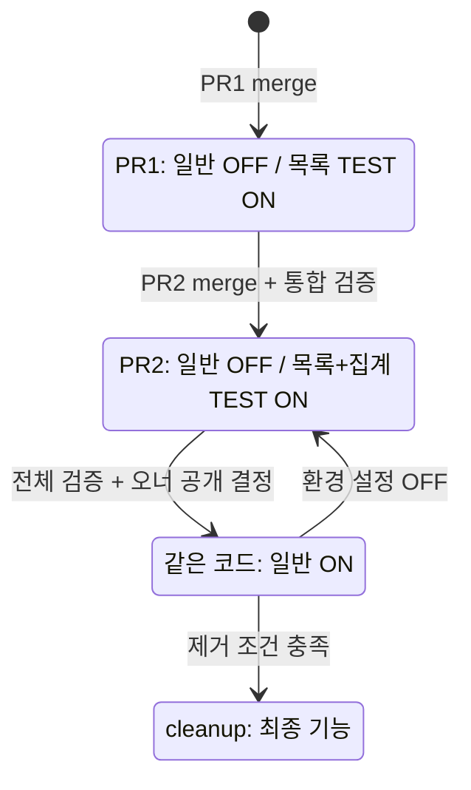

# Spec: 목록과 집계를 하나의 공개 단위로 제공
Upstream: intent.md@4a74823. Status: draft.
Skills applied: none（root가 고정 연구자료를 바탕으로 작성한 합성 예시）.
작성 권한: 사용자가 설계 패키지 작성을 허가했다. Upstream은 제작 입력이며 제품 수락을 뜻하지 않는다.

[입력](context.md). 두 구현 PR이 같은 공개 제어를 쓴다. 이 파일이 spec 정본이며 과거 실행 결과는 참고 자료다.

## Requirements
| ID | 변경·보존 계약 | 근거 |
|---|---|---|
| R1 | list --owner ID: 정확 일치·대소문자 구별·완료 포함·원순서, null 비일치 | Q1 |
| R2 | summary [--owner ID]: all/open/done 수를 이 순서로 출력. owner 생략은 전체 | Q1 |
| R3 | 새 조회 무쓰기, 기존 list/show/complete·데이터·오류 유지 | intent |
| R4 | 목록+집계가 한 공개 단위. 완성 전 일반 OFF, 개발자는 구현된 부분만 ON 시험 | intent/Q2 |
| R5 | 설정만으로 공개/중단. 안정화·구버전 의존 확인 후 같은 의미의 최종 기능을 유지하며 제어 제거 | Q3 |

## Acceptance criteria
원 데이터 네 행을 각 사례에 새로 사용한다. 집계 형식은 이름과 정수 사이 탭, 행 끝 개행이다.
| ID → 요구 | 상태·행동 | 기대 |
|---|---|---|
| AC1 → R1,R3 | ON: list --owner hana | R-101/R-103만 원순서·기존 열, rc0, 바이트 불변 |
| AC2 → R1,R3 | ON: list --owner nobody/HANA/- 각각 | 빈 stdout·rc0, 바이트 불변 |
| AC3 → R2,R3 | 두 기능 구현 후 ON: summary, summary --owner hana/min/nobody | 각각 (4,3,1), (2,1,1), (1,1,0), (0,0,0)의 all/open/done 세 줄·rc0·무쓰기 |
| AC4 → R2,R3 | complete R-101 후 ON: summary --owner hana | (2,0,2). 완료 뒤 바이트를 기준으로 집계 무쓰기. all=open+done |
| AC5 → R3,R4 | 제어가 있는 판의 OFF: list --owner hana, summary | 둘 다 argparse rc2로 거부. 기존 무옵션 list/show/complete는 기존대로 |
| AC6 → R4,R5 | 같은 완성 코드에서 OFF→ON→OFF | 설정만으로 새 명령 허용/거부 전환, 기존 동작 유지 |
| AC7 → R5 | 제거 조건을 충족한 별도 cleanup 판 | 설정 없이 최종 AC1–4와 기존 명령 동작. 예전 OFF 거부는 이 판의 요구가 아님 |

AC3의 표는 세 수의 순서까지 고정한다. 예: 전체 stdout은 `all\t4\nopen\t3\ndone\t1\n`.
스키마는 status=open/done만 지원한다. 다른 상태의 수를 누락한 채 all=open+done이라고 주장하지 않는다.

## Design
공유 제어 이름은 `TRACKER_OWNER_INSIGHTS`. 프로세스 시작 시 "1" 또는 대소문자 무관 "true"만 ON,
unset/그 외는 OFF. 주변 공백은 제거하지 않는다. CLI를 실행하는 각 새 프로세스가 자기 환경을 읽는다.
OFF에서는 argparse에 list의 --owner와 summary를 등록하지 않아 직접 호출도 rc2다.
기존 명령의 등록·파일 오류 처리는 보존한다. ON일 때만 등록하는 같은 판정 함수를 두 PR에서 재사용한다.
이 로컬 환경 변수는 사용자 인증이나 서버 권한 장벽이 아니다.

summary는 읽은 배열에 R1과 같은 필터를 적용한 뒤 all=len, open/done의 수를 세고 출력한다.
새 쓰기·집계 저장·캐시·새 클래스는 없다. helper 이름은 예시 수준이며 출력/제어 의미가 계약이다.

PR1의 TEST ON은 목록만 구현된 상태다. summary는 ON에서도 아직 없다. PR2부터 ON에서는 있어야 한다.
공개 담당은 합성 업무 오너(root 역할), 환경 조작·관측은 개발 실행자다. 공개는 전체 AC1–6와
최신 main 통합 검증 후 별도 결정한다. 일반 실행 환경에 ON을 적용/제거하고 새 CLI 프로세스로 확인한다.
중단 OFF는 이미 한 쓰기를 되돌리지 않는다(새 기능은 조회뿐).

cleanup은 PR2 통합·공개/중단 관측, 알려진 구버전/복구 대상의 flag 의존 없음, 오너의 정리 요청이
충족된 뒤 별도 PR이다. 설정이 없어도 최종 기능이 동작하는 코드/시험/설명을 먼저 배포한 뒤
남은 설정을 제거한다. 합성 예시에서 이 조건들은 아직 이행되지 않았다.

## Constraints and scope
로컬 CLI 모의. hosted 배포·인증·장기 안정성 검증은 범위 밖이다. 두 기능은 한 공개 단위이며
PR마다 기능 노출 코드를 수동 전환하지 않는다. 다중 담당자·정렬·새 status·데이터 이행은 제외한다.

## Open questions
- Q1 answered: R1/R2와 AC의 합성 오너 답/역사 계약.
- Q2 answered: 프로세스별 환경 제어. 개발 ON과 일반 공개는 별개(R4/Design).
- Q3 answered: 위 책임/조건. 실제 공개·제거 결정은 해당 시점에 기록하며 미리 승인 처리하지 않음.

## Flagged concerns
부분 시험 성공을 전체 공개 승인으로 바꾸지 않는다. 이 로컬 제어를 실제 서비스에 적용할 때는
실제 배포·권한 경계를 다시 설계해야 한다. 현재 합성 CLI에서는 미해결 설계 우려 없음.
