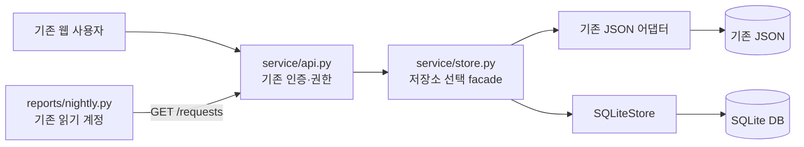
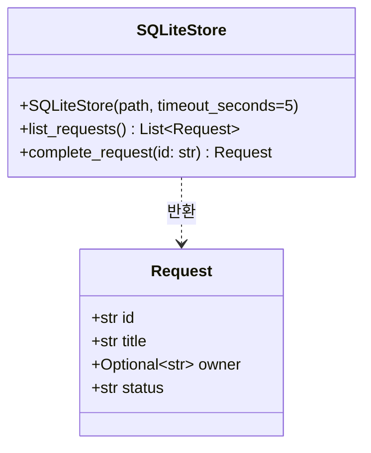
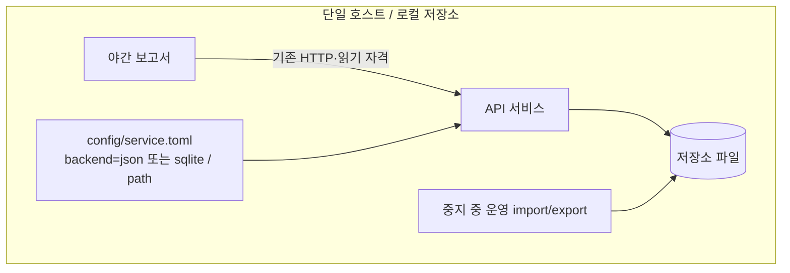

# M01 설계 정본: 구성·계약·배포
[spec 진입점](../spec.md) · 이 문서의 경계/호출 계약은 제안 설계다. 가상 코드 관측 결과가 아니다.

## 구성과 데이터 소유

이행 후 보고서는 JSON을 직접 읽지 않는다. 서비스 facade만 활성 저장소를 선택하며 이중 쓰기하지 않는다.
API의 기존 인증과 권한은 그대로다. 완료는 담당자 본인·운영자만 가능하며 거부 요청은 쓰기 호출 전에 끝난다.
이 범위에서는 owner 변경 기능이 없으므로 권한 확인 후 owner가 바뀌는 새 경합 경로를 만들지 않는다.

## 저장 인터페이스와 오류
기존 facade의 list_requests(), complete_request(id)는 유지한다. 아래 SQLite 클래스는 새 설계의
공유 계약이다. 내부 SQL 메서드는 구현 중 정한다. Json 어댑터는 기존 형태를 유지하고 facade가 연결한다.

Request는 런타임에 기존 dict이며 별도 도메인 클래스 생성 요구가 아니다. Optional[str] owner는
문자열 또는 null을 뜻한다. list는 별도 dict들의 원순서 목록, complete는 완료된 행 dict를 반환한다.
외부에 연결/트랜잭션 객체를 넘기지 않는다. 호출 단위 연결을 열고 닫아 스레드 간 연결을 공유하지 않는다.
실제 필드/제약은 [storage](storage.md)가 정본이다.

새 service/storage_errors.py에 RequestNotFound와 StorageUnavailable을 둔다. SQLiteStore는 없는 ID를
전자, sqlite3 저장 오류를 후자로 바꾸고 원자 실패를 보장한다. facade/API 연결 PR은 기존 JSON 오류도
기존 HTTP 의미로 유지하며 이 두 예외를 404/503에 매핑한다. API 인증401/권한403은 저장 예외와 구분한다.
503 body는 {"error":"temporarily_unavailable"}이며 내부 SQL·파일 경로를 넣지 않는다.
기존 401/403/404 body의 바이트 규약은 제공되지 않았으므로 가상 기존 계약 시험을 기준으로 보존한다.

## 배포 경계

보고서와 서비스는 별도 실행 주체라 중지 때 둘 다 확인한다. config의 기본 backend=json을 유지하며
sqlite는 명시 선택한다. 알 수 없는 backend·사용 불가 DB에서 JSON으로 자동 fallback하지 않는다.
backend와 path는 서비스 시작 시 읽고, sqlite 선택은 이미 존재하는 DB만 열어 user_version=1과
storage.md의 필수 테이블/열·제약을 확인한 뒤 수락한다. 경로 누락·잘못된 스키마/버전·열기 실패는
새 빈 DB를 생성하거나 JSON으로 돌아가지 않고 시작 실패로 드러낸다. 실제 설정 키 이외의 호스트
경로/서비스 관리 명령은 Q4가 정한다. DB를 여러 호스트가 공유하는 배포는 범위 밖이다.
