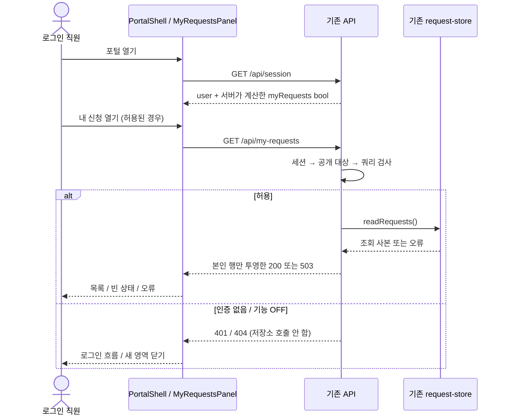

# Spec: 포털에서 본인의 신청 상태 조회
Upstream: intent.md@be0031d. Status: draft.
Skills applied: none — 고정 연구자료를 바탕으로 root가 작성한 합성 예시. [현재 계약·답변·작성 허가](context.md).

직원이 자기 신청의 상태를 담당자에게 묻는 흐름을 포털의 읽기 화면으로 옮긴다. 기존 인증·저장소를 재사용하고
서버가 본인 데이터만 고른다. API와 화면을 모두 준비한 뒤 같은 공개 제어로 제공한다. 이 파일이 W01 설계 정본이다.
실제 제품 승인/실행은 아니며 원 요청·후속 답은 위 입력 판으로 보존한다.

## Requirements

| ID | 변경·보존 계약 | 근거 |
|---|---|---|
| R1 | 로그인한 직원이 자기 신청의 id/title/status를 조회. 완료 포함·최근 갱신순·동률 id 오름차순 | intent/Q1 |
| R2 | 서버 세션으로 본인을 정하고 다른 신청·requesterId·내부 메모는 반환하지 않음. 조회 무쓰기 | intent 제약/현재 계약 |
| R3 | 로딩·빈 결과·오류를 구분. 오류 때 사용자가 다시 시도할 수 있음 | Q2 |
| R4 | 기존 로그인/로그아웃·신청·관리 기능과 데이터 유지, 새 권한/계정/서비스 없음 | intent |
| R5 | API+화면이 한 공개 단위. 개발 중 허용한 시험 직원만 ON, 일반 OFF. 설정으로 공개/중단 | Q3/공개 정책 |

## Acceptance criteria

아래 데이터와 기대의 정본은 [입력 Dataset](context.md#dataset)이다. API/화면의 상세 형식은 Design을 따른다.

| ID → 요구 | 조건·행동 | 관찰할 결과 |
|---|---|---|
| AC1 → R1/R2 | 허용한 u1이 새 API 조회/내 신청 화면 열기 | REQ-11, REQ-12 순서의 두 건만. 화면은 접수/완료로 표시. 내부 필드 없음, 원본 데이터 불변 |
| AC2 → R1/R2 | u3을 시험 대상으로 허용해 조회, 동률 시각 사본도 조회 | u3은 200 requests:[] 및 빈 상태. 동률은 id 오름차순. u1 권한으로 u2 데이터를 지정할 수 없음 |
| AC3 → R2/R4 | 미로그인·임의 requesterId 쿼리·일반 OFF·설정 오류 | 아래 우선순위로 401/400/404, 거부 시 저장소 조회/쓰기 없음. 브라우저 값을 바꿔도 서버 판단 유지 |
| AC4 → R3 | 응답 지연/저장소 실패/네트워크 오류 후 재시도 | 로딩은 빈 상태가 아님. 오류에서 이전 목록을 비우고 안내·재시도 제공. 재시도 한 요청 후 실제 성공 결과 표시 |
| AC5 → R3/R4 | 화면을 닫거나 로그아웃한 뒤 이전 응답이 도착, 조회 중401/404 | 늦은 응답이 목록을 다시 표시하지 않음. 401은 기존 로그인 흐름, 404는 새 영역 닫기·숨김 |
| AC6 → R4 | 양 공개 상태에서 기존 포털·서버 회귀, 키보드로 내 신청 열기/재시도 | 기존 계약 유지, 키보드 조작·상태 안내, 신청 title은 텍스트로 표시 |
| AC7 → R5 | 같은 완성 코드에서 일반 OFF→시험 u1 ON→전체 ON→OFF | 서버/API와 새로 연 포털의 동일 판단. API만 준비된 상태는 전체 공개 근거가 아님. OFF 후 아래 전파/중단 계약 준수 |
| AC8 → R1/R2/R4/R5 | 공개 후 조건을 충족해 제어 제거한 판 | 로그인한 본인 조회와 권한/무쓰기/화면 계약 유지. 폐기한 임시 OFF/시험대상 조건을 새 판에 강제하지 않음 |

## Design

### Approach and boundaries

현재 데이터와 인증은 이미 서버에 있다. 브라우저에 전체 신청을 보내 필터링하면 숨겨야 할 동료 데이터도
전송되므로 서버에서 requesterId를 세션 ID와 비교한 뒤 공개 필드만 투영한다. 별도 검색/권한 서비스는 필요 없다.
현재 직원당 최대 100건이라는 입력 범위에서 한 번 조회하며, 자동 polling 대신 사용자가 열거나 재시도할 때만 읽는다.
실시간 갱신 지연은 감수하지만 담당자 문의를 줄이는 이번 목적에는 맞는다. 규모/갱신 요구가 달라지면 이 선택을 재검토한다.



이 그림은 완성한 기능의 경계와 분기를 요약한다. 정확한 오류/화면 의미는 아래 계약이 소유한다.
순차 API 흐름과 책임이 충분히 드러나므로 클래스/배포 도식을 추가하지 않는다.

### API and data

새 GET `/api/my-requests`를 기존 앱에 등록한다. 기존 requireUser로 세션을 확인하고
`featureEnabled("myRequests", req.user.id)`를 같은 서버에서 평가한다. 허용되지 않으면 즉시 반환한다.
쿼리 파라미터는 받지 않는다. 다른 사용자의 ID를 받거나 운영자용 전체 목록으로 바꾸지 않는다.

| 우선순위/조건 | 응답/효과 |
|---|---|
| 1. 인증 없음 | 401 {"error":"unauthenticated"}; 저장소 호출 안 함 |
| 2. 해당 사용자 기능 OFF/평가 실패 | 404 {"error":"not_found"}; 저장소 호출 안 함 |
| 3. 어떤 쿼리 파라미터든 존재 | 400 {"error":"bad_request"}; 저장소 호출 안 함 |
| 4. readRequests 실패 | 503 {"error":"temporarily_unavailable"}; 내부 오류/데이터를 노출하지 않음 |
| 5. 정상 | 200 {"requests":[{"id":"REQ-11","title":"키보드 신청","status":"open","updatedAt":"2026-09-02T09:00:00Z"}, ...]} |

성공 항목은 id/title/status/updatedAt 네 필드만 갖는다. 마지막 행의 ...는 생략 표시이며 실제 JSON 필드가 아니다.
정확한 u1 전체 값은 context의 REQ-11/REQ-12 행에서 이 네 필드를 투영한 값이다.
updatedAt 내림차순, 동률 id 문자열 오름차순으로 사본을 정렬한다. 입력 형식은 context 계약대로이며 기존 배열/객체를 수정하지 않는다.
모든 새 API 응답은 JSON, Cache-Control: no-store. 브라우저도 응답을 localStorage 등에 저장하지 않는다.

GET `/api/session`은 기존 user를 유지하고 `features.myRequests`에 같은 함수의 bool만 추가한다.
시험 사용자 목록이나 설정 원문은 전달하지 않는다. 응답의 bool은 표시 편의이며 API의 인증/대상 검사를 대체하지 않는다.

### UI states

포털의 세션 조회가 끝나고 features.myRequests=true일 때만 기존 탐색 영역에 **내 신청** 버튼을 보인다.
버튼을 누르면 기존 신청 폼 대신 MyRequestsPanel을 같은 포털 안에서 표시한다. 기존 신청 화면으로 돌아갈 수 있고 URL 라우트를 새로 만들지 않는다.
패널을 열 때 조회한다. 같은 화면을 보고 있을 때 자동 polling·주기 갱신·임의 중복 요청은 없다.

| 상태/전이 | 화면과 동작 |
|---|---|
| loading | 제목 “내 신청”, “불러오는 중…”을 상태 영역으로 안내. 목록/빈 문구/재시도 버튼 없음 |
| success | “신청 번호 / 제목 / 상태” 세 열. open=접수, in_progress=처리 중, done=완료. 서버 순서 그대로, 제목은 텍스트 |
| empty | 제목과 “아직 신청한 내역이 없습니다.”. 실패와 구분 |
| error | 목록을 비우고 “신청 내역을 불러오지 못했습니다.”, “다시 시도” 버튼. 버튼을 누르면 loading으로 한 번 전이 |
| 401 | 목록을 비우고 기존 세션 만료/로그인 흐름으로 전달. 임의의 빈 목록으로 처리하지 않음 |
| 404 | 목록을 비우고 패널/내 신청 버튼을 숨김. 기존 신청 화면으로 돌아가 “현재 사용할 수 없는 기능입니다.” 안내 |
| 화면 닫기/로그아웃 | 요청 취소 및 늦은 결과 무시. 다시 열면 새 요청. 이전 사용자의 데이터를 재사용하지 않음 |

네트워크·timeout·예상 못한 400/비정상 응답 형식은 error로 처리한다. 상태 안내는 aria-live 영역,
오류는 role=alert로 읽을 수 있게 하고 버튼은 키보드로 접근한다. 실제 response를 성공/빈 상태로 검증한 후 표시한다.
레이아웃의 정확한 px/색상은 기존 포털 컴포넌트를 따른다. 아래는 정보 배치 예이며 픽셀 기준 mock은 아니다:

```text
[신청하기] [내 신청]
내 신청
신청 번호   제목          상태
REQ-11      키보드 신청   접수
REQ-12      모니터 신청   완료
```

공유 상태는 PortalShell의 현재 세션/선택 화면, 패널의 loading/success/empty/error다. getJson의 AbortSignal을
연결하고 닫힌 패널/교체된 요청의 응답은 무시한다. 새 전역 상태 라이브러리·영구 캐시는 만들지 않는다.

### Release and disable

[팀 공개 정책](../../../../../../RELEASE-CONTROL.md)을 기존 config/features.json의 `myRequests` 한 키에 적용한다.
기본 누락은 OFF, 시험 설정은 `{enabled:false,testUsers:["u1"]}`, 일반 공개는 `{enabled:true,testUsers:[]}`다.
설정 해석/재시작은 context의 기존 제어 계약을 따른다. 프런트엔드에 독립 플래그를 만들지 않는다.
API만 준비한 단계에서도 일반 사용자 OFF이며 허용된 직원의 API 시험만 가능하다. 화면까지 통합된 뒤 전체 공개 단위를 판정한다.

OFF는 서버 재시작 뒤 새 요청부터 적용한다. 이미 열린 포털의 세션 bool은 자동 갱신되지 않으므로
새로 열기/새로고침 시 버튼이 사라지고, 그 전에 API를 다시 호출하면 404로 패널을 닫는다.
이미 내려받아 화면에 표시된 본인 목록을 원격으로 지우지는 않는다. 이는 공개 제어의 전파 한계이며 인증 권한을 넓히지 않는다.

포털 오너가 완성 코드의 전체 AC와 OFF 복귀 근거를 확인해 공개를 결정하고 운영 담당이 설정/재시작한다.
기존 운영 기록 `docs/operations-log.md`에 코드 판·설정/대상·결정/적용·관측을 남긴다.
안정화/되돌림 관측과 구버전 flag 의존 해소 후 오너가 정리를 요청하면 별도 cleanup PR에서 최종 본인 조회를 유지하며
임시 release 조건과 폐기된 시험을 정리한다. 인증/소유권 검사는 계속 유지한다. 코드 배포 뒤 남은 설정을 정리한다.

## Constraints and scope

새 서비스·계정·쓰기·상세/검색/페이지·다른 직원 조회·운영자 예외 없음. 현재 시스템과 데이터 범위는 context가 정본이다.
기존 관리 화면은 보존한다. 자동 polling/실시간 flag 전파/픽셀 디자인은 이번 목적에 요구되지 않았다.

## Open questions

- Q1 answered: context의 본인/완료 포함/정렬 답을 R1·API·UI에 반영했다.
- Q2 answered: 열기/재시도 시 조회, 별도 오류 상태. polling의 운영 비용 없이 목적을 충족한다.
- Q3 answered: 서버 시험 대상·단일 공개 단위·오너/운영 역할을 Release에 반영했다.

## Flagged concerns

본인 데이터·공개 상태·기존 기능 영향 범위를 검토했다. 현재 합성 설계에 중요한 미해결 정책 충돌은 없다.
설정 OFF의 화면 전파 한계는 Release에 명시했다. 실제 제품에서는 현재 인증/제어 계약과 운영 명령을 먼저 확인해야 하며,
이 교육 문서가 실환경의 정책 적용이나 공개 승인을 대신하지 않는다.
