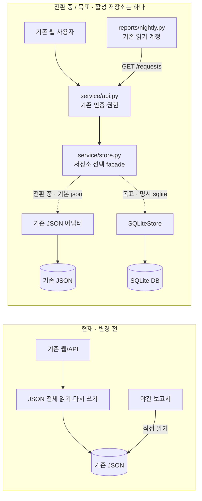
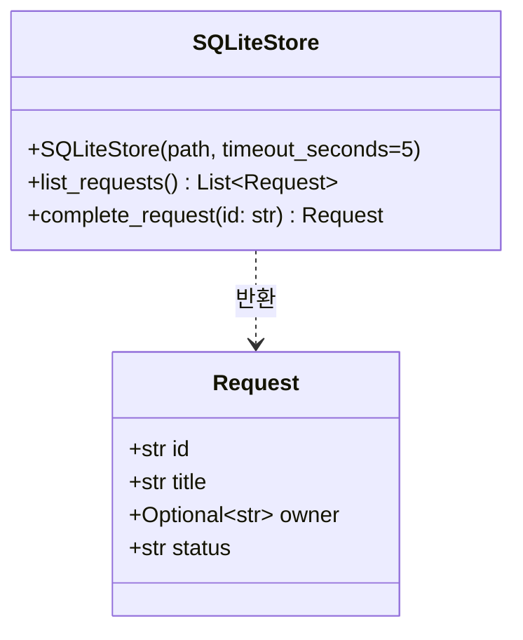
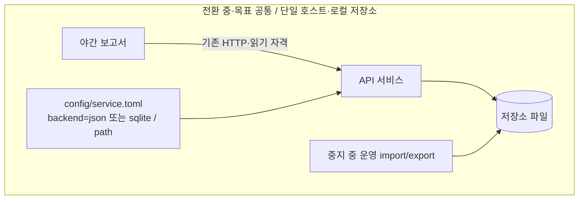

# M01 설계 정본: 구성·계약·배포
[spec 진입점](../spec.md) · 이 문서의 경계/호출 계약은 제안 설계다. 가상 코드 관측 결과가 아니다.
기존 HTTP 응답·권한·환경 제약은 [현재 입력 계약](../inputs/current-contract.md#current-behavior-and-constraints),
입력의 미제공 범위는 [Limits](../inputs/current-contract.md#limits-of-the-supplied-input)에서 직접 확인한다.

## 구성과 데이터 소유

**SP01 — 활성 저장소와 소비자 경계.** 관련 요구: R1, R2, R6. 본 절과 Representative flow가 정본이다.
현재는 API의 JSON 전체 쓰기와 보고서의 직접 JSON 읽기가 있다. 목표는 API facade가 선택한 저장소를
웹과 보고서가 함께 읽는 구성이다. 보고서를 API로 옮긴 전환 중에는 JSON이 활성이고, 검증된 운영 전환 뒤에는
SQLite가 활성이다. 아래 점선은 상태별 선택 경로이며 동시에 연결해 쓰는 경로가 아니다.

이행 후 보고서는 JSON을 직접 읽지 않는다. 서비스 facade만 활성 저장소를 선택하며 이중 쓰기하지 않는다.
API의 기존 인증과 권한은 그대로다. 완료는 담당자 본인·운영자만 가능하며 거부 요청은 쓰기 호출 전에 끝난다.
이 범위에서는 owner 변경 기능이 없으므로 권한 확인 후 owner가 바뀌는 새 경합 경로를 만들지 않는다.

## Representative flow

SQLite를 명시 선택한 목표 상태에서 기존 사용자의 완료 요청 한 건은 다음 경계를 지난다.

1. API는 `POST /requests/{id}/complete`의 기존 인증·권한을 검사한다. 미인증·권한 부족이면
   기존 응답으로 끝내며 facade의 쓰기를 호출하지 않는다.
2. API는 facade의 `complete_request(id)`를 호출한다. facade는 시작 때 검증·선택한 저장소를 사용한다.
   DB 선택·열기·스키마 실패는 아래 시작 검증에서 드러나며 요청마다 다른 저장소로 돌아가지 않는다.
3. SQLiteStore는 [storage의 완료 트랜잭션](storage.md#트랜잭션과-동시성)에서 해당 ID의 상태만 바꾼다.
   겹친 다른 완료는 잠금을 얻은 뒤 자신의 ID를 처리하므로 앞선 완료를 덮지 않는다.
4. commit한 행을 facade에 반환하고 API가 기존 완료 응답으로 전달한다. 없는 ID와 저장 실패는
   아래 예외 매핑을 따른다. 실패한 완료는 rollback되어 부분 성공으로 응답하지 않는다.
5. 후속 `GET /requests`와 야간 보고서는 같은 API→활성 저장소 경로를 읽는다. 보고서는 API 실패를
   오류로 드러내고 옛 JSON으로 대체하지 않는다. 클라이언트가 완료 응답을 놓쳤다면 재조회하거나
   같은 완료를 재시도할 수 있으며 [멱등 계약](storage.md#트랜잭션과-동시성)에 따라 결과가 유지된다.

## 저장 인터페이스와 오류

**SP02 — 저장 인터페이스·연결 수명·오류 매핑.** 관련 요구: R1, R2, R5. 이 절이 정본이다.
기존 facade의 list_requests(), complete_request(id)는 유지한다. 아래 SQLite 클래스는 새 설계의
공유 계약이다. 내부 SQL 메서드는 구현 중 정한다. Json 어댑터는 기존 형태를 유지하고 facade가 연결한다.

목표 SQLite 어댑터의 논리 인터페이스:

Request는 런타임에 기존 dict이며 별도 도메인 클래스 생성 요구가 아니다. Optional[str] owner는
문자열 또는 null을 뜻한다. list는 별도 dict들의 원순서 목록, complete는 완료된 행 dict를 반환한다.
외부에 연결/트랜잭션 객체를 넘기지 않는다. 호출 단위 연결을 열고 닫아 스레드 간 연결을 공유하지 않는다.
실제 필드/제약은 [storage](storage.md)가 정본이다.

새 service/storage_errors.py에 RequestNotFound와 StorageUnavailable을 둔다. SQLiteStore는 없는 ID를
전자, sqlite3 저장 오류를 후자로 바꾸고 원자 실패를 보장한다. facade/API 연결 PR은 기존 JSON 오류도
기존 HTTP 의미로 유지하며 이 두 예외를 404/503에 매핑한다. API 인증401/권한403은 저장 예외와 구분한다.
503 body는 {"error":"temporarily_unavailable"}이며 내부 SQL·파일 경로를 넣지 않는다.
기존 401/403/404 body의 바이트 규약은 [입력에 제공되지 않았다](../inputs/current-contract.md#limits-of-the-supplied-input).
실제 제품에 적용할 때 확인한 기존 계약 시험을 기준으로 보존하며 이 합성 예시에서 값을 새로 정하지 않는다.

## 배포 경계

**SP03 — 기본 JSON과 명시 SQLite 시작 검증.** 관련 요구: R2, R3, R5. 이 절이 정본이다.

보고서와 서비스는 별도 실행 주체라 중지 때 둘 다 확인한다. config의 기본 backend=json을 유지하며
sqlite는 명시 선택한다. 알 수 없는 backend·사용 불가 DB에서 JSON으로 자동 fallback하지 않는다.
backend와 path는 서비스 시작 시 읽고, sqlite 선택은 이미 존재하는 DB만 열어 user_version=1과
storage.md의 필수 테이블/열·제약을 확인한 뒤 수락한다. 경로 누락·잘못된 스키마/버전·열기 실패는
새 빈 DB를 생성하거나 JSON으로 돌아가지 않고 시작 실패로 드러낸다. 실제 설정 키 이외의 호스트
경로/서비스 관리 명령은 Q4가 정한다. DB를 여러 호스트가 공유하는 배포는 범위 밖이다.
