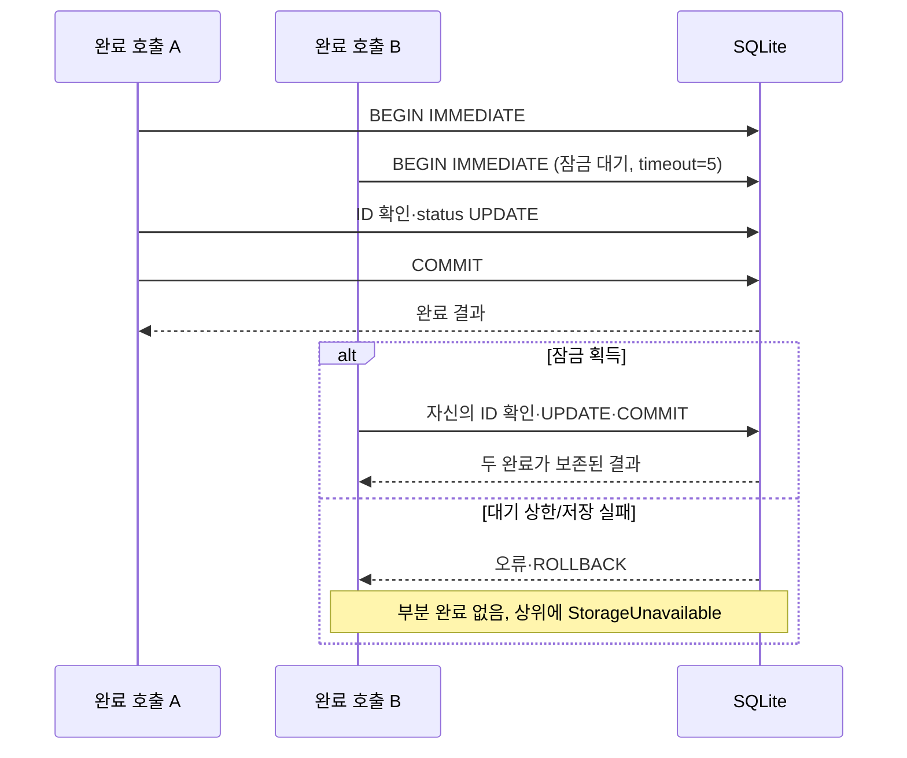

# M01 설계 정본: 스키마·원자성·이행 계약
[spec 진입점](../spec.md). 새 SQLite 설계이며 과거 예시에 없던 중요한 결정을 여기서 정한다.

## 데이터 계약

**SP04 — 데이터 스키마·순서 보존.** 관련 요구: R2, R3, R4. 이 절이 정본이다.
입력 JSON의 최상위 키는 schema_version, requests만, schema_version은 정수 1(불리언 제외)이다.
requests는 배열, 각 행은 id/title/owner/status 네 키를 모두 갖는다. id/title 문자열, owner 문자열 또는 null,
status는 open/done. 빈 문자열을 금지한다는 새 요구는 만들지 않는다. id는 대소문자 구별 유일이다.
알 수 없는 키·누락·타입·버전·중복 ID는 이행 오류이며 버리거나 보정하지 않는다.

SQLite user_version=1, requests 한 테이블:
| 열 | 타입·제약 | 의미 |
|---|---|---|
| id | TEXT PRIMARY KEY NOT NULL, BINARY 비교 | 원 ID 그대로 |
| title | TEXT NOT NULL | 원 문자열 |
| owner | TEXT 또는 NULL | 미배정 그대로 |
| status | TEXT NOT NULL, CHECK IN ('open','done') | 상태 |
| ordinal | INTEGER NOT NULL UNIQUE, CHECK >= 0 | import 배열의 0부터 시작하는 순번 |

import 전에 Python에서 엄격한 입력 타입(불리언/숫자 coercion 제외)을 검사한다. DB 접근은 어댑터/이행
도구만 하며 바인딩 파라미터를 쓴다. 공개 list는 ORDER BY ordinal, ordinal을 API에 노출하지 않는다.
이 범위에는 삽입/삭제 API가 없다. export도 ordinal 순서와 schema_version=1을 복원한다.

## 트랜잭션과 동시성

**SP05 — 행 단위 완료·멱등성·원자 실패.** 관련 요구: R1, R2, R5. 이 절이 정본이다.
각 complete 호출은 timeout=5초 연결, BEGIN IMMEDIATE로 write transaction을 얻고 ID 존재를 조회한다.
없으면 rollback/RequestNotFound. open이면 그 ID의 status만 done으로 UPDATE, 이미 done이면 UPDATE 없이
같은 결과를 반환한다. 성공 commit 후에만 결과 반환. 실패는 rollback하고 StorageUnavailable로 매핑한다.
재시도는 상위의 새 호출이며 무한 retry나 추가 5초 loop를 두지 않는다. SQLite 기본 rollback journal과
synchronous=FULL을 사용하며 영속성을 끄지 않는다. 바쁜 잠금 대기의 timeout=5는 설정 상한이고
전체 HTTP 응답 시간을 엄밀히 5초로 보장한다는 새 성능 계약은 아니다.

list는 단일 SELECT snapshot을 읽고 연결을 닫는다. complete는 JSON 전체 덮어쓰기를 하지 않으므로
서로 다른 완료가 덮이지 않는다. 이미 done의 결과 동일은 API 멱등 계약이며 DB파일 바이트 동일을 약속하지 않는다.

## import/export CLI 계약

**SP06 — 원본 보존과 새 출력의 이행·복구 CLI.** 관련 요구: R3, R4. 이 절이 정본이다.
- `python3 tools/migrate_store.py import --source input.json --target new.db`
- `python3 tools/migrate_store.py export --source current.db --target new.json`

성공 rc0, 실패 rc1와 stderr의 작업/오류 분류. 자격/원 데이터 전문은 출력하지 않는다.
어느 모드도 기존 target을 덮어쓰지 않는다. source와 target이 같은 파일/경로인 경우 거부한다.
import는 전체 입력 검증 후 배타적으로 새 target을 만들고 단일 트랜잭션에 스키마·모든 행을 작성,
commit 뒤 다시 읽어 전체 값/순서 대조한다. 실패/중단 뒤 남은 새 target은 성공 저장소로 쓰지 않는다.
source를 보존하고 원인을 확인한 뒤 다른 새 target으로 재실행한다. 파일 존재 자체는 성공 신호가 아니다.
실패 파일 자동 삭제에 의존하지 않으며 운영자가 이 작업에서 만든 미사용 파일임을 확인해야 정리할 수 있다.

export는 쓰기를 중지한 상태의 정상 DB에서 일관된 읽기 트랜잭션으로 전체를 읽고 JSON을 새 파일에 쓴다.
DB user_version/행/순서 유효성을 확인하고 정상 완결 후 다시 읽어 값/순서 대조한다. 실패한 부분 JSON은
복구에 쓰지 않고 다른 새 target으로 재시도한다. SQLite API로 읽으며 DB/journal을 임의 복사/삭제하지 않는다.
